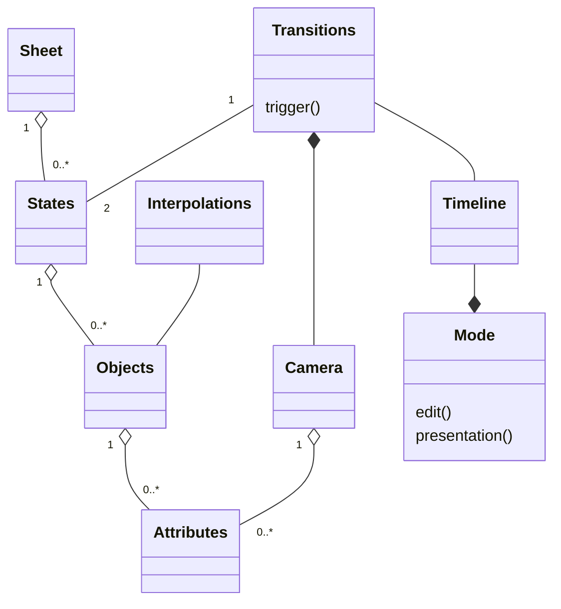

# **Requirements**

## Domain model:

## Lexicon
### [1] State
A state is a combination of objects (0 or more). Multiple states are present on a single sheet and change according to transitions.

### [2] Attributes
It provides a description of objects and camera where attributes vary as per different objects.

### [3] Objects
Objects can have 0 or more attributes. There will be a combination of objects in states. Various objects can have same interpolation methods.

### [4] Transitions
Transition provides a triggering of states (Transformation) with respect to interpolation. The camera moves according to the transition of states.

### [5] Interpolation
Interpolation provides information about transition of objects. The same interpolation method can be applied to multiple objects.

### [6] Camera
It has multiple attributes, which focuses on current state.

### [7] Timeline
A timeline describes the sequence (flow) of transitions which can be presented or edited according to modes

### [8] Mode
Each sheet consists of two mode types (Edit and Presentation) where edit mode isthe default one in which user can define and manipulate various states, transitions, objects, and interpolation.

### [9] Sheet
User can create a new sheet or load an existing sheet. After editing a sheet, user can save it for later use. Each sheet can contain multiple states.

## User Stories
    1. Sheets
        1.1. A user can create a new SHEET.
        1.2. A user can load a previously saved sheet.
        1.3. A user can save a sheet.
        1.4. A user can specify the start state.
        1.5. A user can exit a sheet.

    2. States
        2.1. A user can add a state to a sheet.
        2.2. A user can delete a state.
        2.3. A user can reorder states.
        2.4. A user can view the presentation at any state.

    3. Objects
        3.1. A user can add different type of objects.
        3.2. A user can delete an object.
        3.3. A user can edit an object (by changing value of attributes).

    4. Transition
        4.1. A user can add a transition.
        4.2. A user can delete a transition.
        4.3. A user can edit a transition.

    5. Interpolation
        5.1. A user can adjust an object’s mode of transition.

    6. Mode
        6.1. User can switch two modes (Edit or Presentation).

## Use Cases

### Use Case 1: Overview
**Subject**: The Alfa Project  
**Actors involved**: User, The operating System  
**Requirements addressed**: 1.\*, 2.\*, 3.\*, 4.\*, 5.\*  
**Precondition**: The system not started yet

#### Typical flow:

1. User request Operating System to start the Alfa Project
2. Operating System prompts user to create new or sheet are use an existing sheeet
3. if the user selects "Create new"  
    <ol type="a">
        <li> The system creates a new blank sheet. </li>
        <li> User can add/edit/delete objects, states, transitions either by drag and drop or clicking a corresponding button. </li> 
        <li> User can save sheet by clicking the save button. </li>  
        <li> User can alternatively exit the system using the toolbar. </li>
    </ol>
4. Else if the user chooses "Load an existing sheet"  
    <ol type="a">
        <li> The operating System prompts the user to load an existing sheet. </li>
        <li> The User selects a saved sheet which is loaded into the system. </li>
        <li> User can add/edit/delete objects, states, transitions either by drag and drop or clicking a corresponding button. </li> 
        <li> User can save sheet by clicking the save button. </li>  
        <li> User can again exit the system using the toolbar. </li>
    </ol>

#### Alternative flow:
- If the user selects cancel in the file picker (in step 4.a),
the process starts again at step 2.  

**Postcondition**: The system is operational.

### Use Case 2: Switching between modes
**Subject**: The Alfa Project  
**Actors involved**: User, The operating System  
**Requirements addressed**: 6.\*  
**Precondition**: The system is started

#### Typical flow:
1. When in edit mode, User can click "Present" to switch directly to presentation mode.
2. When in presentation mdode, user can press "ESC" to switch to edit mode.

**Postcondition**: The system is started.

### Use Case 3: Exit
**Subject**: The Alfa Project  
**Actors involved**: User, The operating System  
**Requirements addressed**: 1.5  
**Precondition**: The system is started

#### Typical flow:
1. The user selects the exit from toolbar, or by using the OS to send a “close” message to the main window.
2. Include “ensure the data is safe”
3. The system requests the Operating System to terminate its process.

**Postcondition**: The system is terminated  
**Alternative paths**: If the user selects cancel in step 2 the use case stops with postcondition “The system is started”. 

